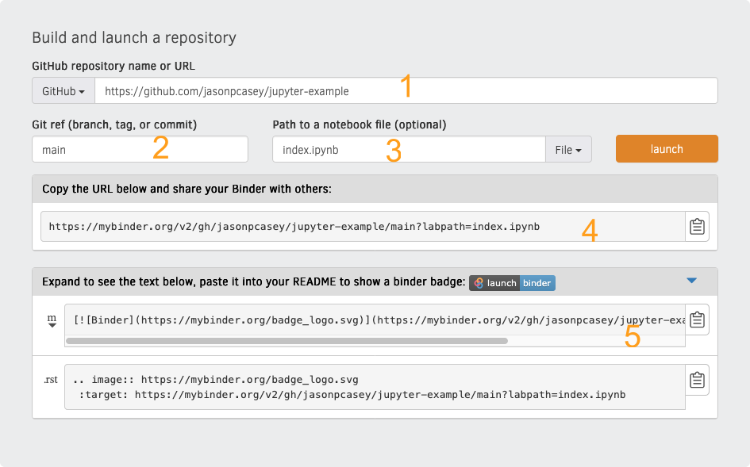

# jupyter-example

## Introduction

This example was created to demo using [Binder](https://notebooks.gesis.org/binder/) to share a Jupyter notebook.

Click below to see the visualization:

*Note that this may require a few moments while the environment renders.*

## BTAA Data Viz Competition Submission Format

For a BTAA Submission, please include the following in your README:

- Name
- Huskers email address
- URL (the one above will suffice)
- Short description on the visualization

## Binder Info

To share your visual publicly, you need to share it where it can be rendered.  Binder was created to share Jupyter notebooks.  It requires the following:

1. A requirements file that contains your application's required libraries.  You can use venv or conda to do this.  See online documentation for each.
2. Your Jupyter notebook.  In this example, I've named it index.ipynb, but you can use any legal filename.
3. A public [Github](https://github.com) repo.  You can create a free Github account if you don't have one. There are numerous tutorials on creating these if you need help.

After you have all the requirements in place, go to [Binder](https://notebooks.gesis.org/binder/).

You will be presented with the following page:

Provide the following info:
  - Your GitHub url (1)
  - The appropriate branch.  *Usually, this is **main***. (2)
  - The name of the notebook, which will provide a direct url to your work (3)

After you've provided the appropriate info click Launch, which will create your python environment and render the notebook.  Once it is done, you may use the generated URL for your submission (4).  If you want to add a badge, as I've done above, copy from field 5 above and paste into README.md.

